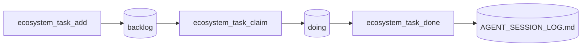
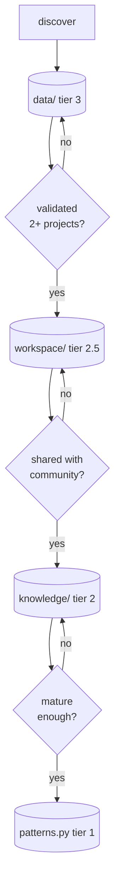

# agentic-ecos

Control plane for traceable agentic infrastructure. `agentic-ecos` is an MCP
server that bootstraps, manages, and operates multi-agent coordination across
your entire digital ecosystem — not just one project.

It generates the full agentic stack in any project (locks, tasks with kanban,
inter-agent communication, session audit, access control, protocol documents,
and an Obsidian vault). It maintains a canonical registry of every project in
your ecosystem and their agentic health. It encodes 15 battle-tested
coordination patterns that agents query to avoid rediscovering the same
solutions. And it handles the complete task lifecycle — create, claim, work,
complete — with git-based traceability that records who did what and when.

All of this works **local-first**: agents coordinate via git push rejection,
no central server required. GitHub Actions and LLM-synthesized automation are
available as an optional layer on top.

- **Python 3.10+** · **git** · **37 MCP tools** · **73 tests** · **[MIT](LICENSE)**
- Compatible with any MCP client: OpenCode, Claude Code, Cursor, and others
- LLM-agnostic automation: DeepSeek, GPT, Claude, Ollama — opt-in
- Vault autodocumental abrible en Obsidian (`docs/`)

```bash
gh repo fork deibanez/agentic-ecos --clone --private
cd agentic-ecos && uv add --dev mcp && uv pip install --editable .
agentic-ecos connect --target ~/repos --agent auto
```

## Why

| You get | Instead of | So you can |
|---------|-----------|------------|
| Multi-agent coordination via git | Central servers, lock services | Any agent, any machine, no extra infra |
| Task lifecycle with T-ID traceability | Ad-hoc bash + manual git | Know who did what and when |
| 15 battle-tested agentic patterns | Rediscovering coordination every project | Reuse proven logic |
| Automated project bootstrapping | Manual setup of locks/tasks/comms | 42 files generated in seconds |
| LLM-agnostic automation (opt-in) | Vendor lock-in | Choose your provider freely |

## Requirements

| Requisito | Mínimo | Nota |
|-----------|--------|------|
| Python | 3.10+ | Compatible con 3.11, 3.12 |
| git | Cualquiera reciente | Coordinación agéntica (git push rejection) |
| Instalador | `uv` (recomendado) o `pip` | `uv` es más rápido; `pip` funciona igual |
| Cliente MCP | Cualquiera | OpenCode, Claude Code, Cursor, etc. — agnóstico |
| LLM (opcional) | Ninguno | Solo para automatización con síntesis de IA (`LLM_API_KEY`) |

## Quickstart

### Setup único — fork privado + instalación

El fork privado cubre ambos casos de uso: las tools del **Modo 1** (simple)
funcionan igual en un fork, y habilita el **Modo 2** (ecosistema) cuando lo
necesites. Solo `main` y `dev` del upstream son públicos — tu ecosistema vive
en el fork privado (trazabilidad completa con `git log`).

```bash
# 0. Fork privado + upstream (una vez)
gh repo fork deibanez/agentic-ecos --clone --private
cd agentic-ecos
git remote add upstream https://github.com/deibanez/agentic-ecos.git

# 1. Dependencias + CLI (una vez)
uv add --dev mcp
uv pip install --editable .

# 2. Branch de ecosistema (una vez) — trazable, registra en AGENT_SESSION_LOG
agentic-ecos ecosystem branch-create mi-eco --base main
#   base=main (estable, recomendado) | base=dev (bleeding edge)

# 3. Plano de control (una vez por ecosistema)
agentic-ecos ecosystem init --name mi-ecosistema --workspace ~/repos

# 4. Conectar el MCP a tu agente (una vez por workspace)
agentic-ecos connect --target ~/repos --agent auto

# 5. Verificar
agentic-ecos protocols
```

### Uso inmediato (Modo 1 — sin registro de proyectos)

Las tools MCP funcionan inmediatamente tras conectar el server:

```bash
# Desde tu agente (con el MCP conectado):
#   init_project("mi-proyecto", preset="monorepo", target_path=".../docs")
#   list_patterns()            → los 15 patrones agénticos
#   validate_structure("...")  → verifica cobertura agéntica
#   protocol_template("agent_protocol") → plantilla de protocolo
```

## How tasks work

Tasks are **local-first**: they run in your agent session using git for
coordination. No central server, no CI/CD required.



**Race-free claiming**: `claim` does `git commit` + `git push`. If two agents
claim the same task, the second push is rejected — the agent picks another.
Every action is traced with a T-ID.

```bash
agentic-ecos ecosystem add-task "Fix staging deploy" --priority high --type ci-cd
agentic-ecos ecosystem task-status --filter unclaimed
agentic-ecos ecosystem claim E1 --agent opencode-nesto
# ... work: changes → verify → commit [agent:: opencode-nesto] ...
agentic-ecos ecosystem done E1 --agent opencode-nesto
```

**GitHub Actions is optional**: `task-automation.yml` automates the same cycle
for `docs`/`ops` tasks. Not needed for daily agent work — see
[CONTRIBUTING.md §9](CONTRIBUTING.md).

## Key design

| Feature | What it does |
|---------|-------------|
| **Auto-context on connect** | The agent receives instructions in the MCP handshake — no need to memorize the 37 tools. `connect` also adds `instructions.md` to the workspace config |
| **Local-first task lifecycle** | Add/claim/done with race-free git push rejection. Every action traced with a T-ID |
| **4-tier knowledge** | Patterns grow: personal → ecosystem → community → built-in |
| **LLM-agnostic** | DeepSeek, GPT, Claude, Ollama — any provider. Works without LLM too (graceful degradation) |
| **Multi-agent MCP** | OpenCode, Claude Code, Cursor — one command: `connect --agent auto` |

## Core tools

| Category | Tools |
|----------|-------|
| Projects | `init_project`, `validate_structure`, `agentic_health` |
| Ecosystem | `ecosystem_init`, `ecosystem_status`, `ecosystem_tasks` |
| Tasks | `ecosystem_task_add`, `ecosystem_task_claim`, `ecosystem_task_done`, `ecosystem_task_status` |
| Knowledge | `list_patterns`, `add_custom_pattern`, `promote_to_knowledge`, `knowledge_status` |
| Git Ops | `ecosystem_branch_create`, `ecosystem_sync_upstream`, `ecosystem_merge_main`, `connect` |

> Full reference: [ARCHITECTURE.md §7](ARCHITECTURE.md) documents all 37 tools.

## Knowledge lifecycle



| Tier | Location | Git | Cycle |
|------|----------|:---:|-------|
| 3 · Personal | `agentic_ecos/data/` (patterns/presets) | ✓ committed (private fork) | `add_custom_pattern` → experiment |
| 2.5 · Ecosystem | `workspace/` | ✓ (tu branch) | `promote_to_workspace` → validated |
| 2 · Community | `agentic_ecos/knowledge/` | ✓ committed | `promote_to_knowledge` → PR to main |
| 1 · Built-in | `agentic_ecos/patterns.py` | ✓ committed | Move to code → everyone |

Solo el **runtime data** (`data/ecosystem-snapshots/`, `data/state.json`) queda
gitignored — no es conocimiento y genera conflictos de merge.

## LLM Automation (opt-in)

Set these secrets to unlock AI-synthesized weekly summaries, task proposals,
PR reviews and automated task loops:

| Secret | Required | Description |
|--------|:---:|-----------|
| `LLM_API_KEY` | ✓ | API key del provider |
| `LLM_MODEL` | ⏸️ | Default `deepseek-chat`. Ej: `gpt-4o`, `claude-3-5-sonnet` |
| `LLM_BASE_URL` | ⏸️ | Solo para providers custom |

**Degradación elegante**: sin `LLM_API_KEY`, los workflows commitean los datos
crudos sin síntesis. El sistema nunca falla por LLM no configurado.

See [CONTRIBUTING.md §9](CONTRIBUTING.md) for the full CI/CD setup.

## CLI reference

```bash
# Projects
agentic-ecos init mi-proyecto --preset monorepo --repos api,frontend
agentic-ecos validate ./ruta/al/vault

# Ecosystem
agentic-ecos ecosystem init --name eco --workspace ~/repos
agentic-ecos ecosystem status
agentic-ecos ecosystem add otro-svc --type frontend

# Tasks (local-first)
agentic-ecos ecosystem add-task "Migrar satet" --priority high --type iac
agentic-ecos ecosystem claim E1 --agent opencode-alpha
agentic-ecos ecosystem done E1 --agent opencode-alpha
agentic-ecos ecosystem task-status --filter unclaimed

# Git ops (traceable)
agentic-ecos ecosystem branch-create mi-eco --base main
agentic-ecos ecosystem sync --branch main
agentic-ecos ecosystem merge-main --target ecosystem/mi-eco

# Knowledge
agentic-ecos promote mi-pattern --to workspace
agentic-ecos promote mi-pattern --to knowledge --source workspace
agentic-ecos knowledge status

# Automation (JSON output for CI)
agentic-ecos ecosystem status --json
agentic-ecos llm-test --prompt "Hola"
```

## Presets

- `monorepo` — múltiples servicios con CI/CD compartido e IaC centralizada
- `single_service` — un servicio con componentes en subdirectorios
- `data_pipeline` — lambdas, jobs batch, pipeline de ingesta/procesamiento

## Structure

```
agentic_ecos/
├── server.py        # MCP server (37 tools)
├── generator.py     # init_project + generate_file + validate + CLI
├── patterns.py      # 15 patrones agénticos (tier 1)
├── protocols.py     # 5 plantillas de protocolos
├── presets.py       # monorepo / single_service / data_pipeline
├── ecosystem.py     # plano de control (agentic.toml, connect, tasks)
├── storage.py       # data/ + knowledge/ + workspace/ carga/guardado
├── knowledge.py     # promoción entre tiers
├── llm.py           # motor de síntesis LLM agnóstico
├── task_loop.py     # desarrollo continuo (detect→claim→plan→execute→verify)
├── knowledge/       # tier 2 · comunidad
├── data/            # tier 3 · personal (snapshots/state gitignored)
├── static/          # scripts copiados tal cual a cada proyecto
└── templates/       # plantillas markdown generables

.github/workflows/   # 5 workflows de automatización
workspace/           # tier 2.5 · solo en branches de ecosistema
docs/00_Global/      # vault autodocumental (Obsidian)
```

## Docs

- [ARCHITECTURE.md](ARCHITECTURE.md) — capas, patrones, plano de control, pipeline de generación
- [CONTRIBUTING.md](CONTRIBUTING.md) — uso, forking, ciclo del conocimiento, privacidad, CI/CD
- [instructions.md](instructions.md) — prompt del agente
- [LICENSE](LICENSE) — MIT License

## Roadmap

- [ ] Extracción de patrones desde agv-docs (upgrade unidireccional)
- [ ] Task loop scheduling (actualmente solo `workflow_dispatch`)
- [ ] RAG opt-in para vaults grandes
